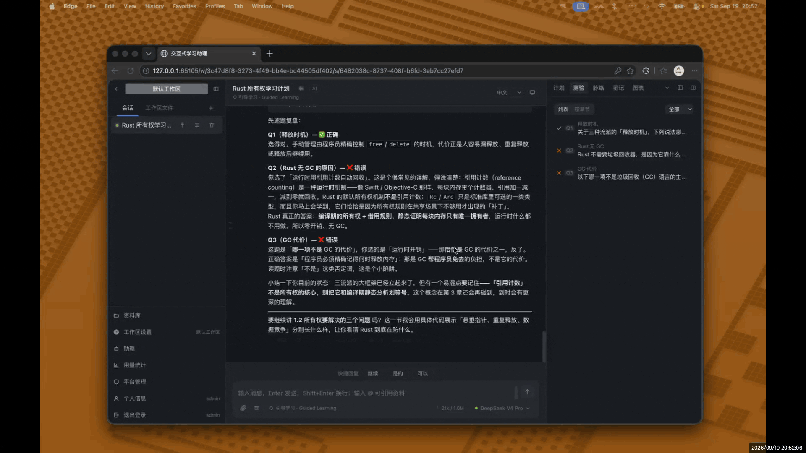
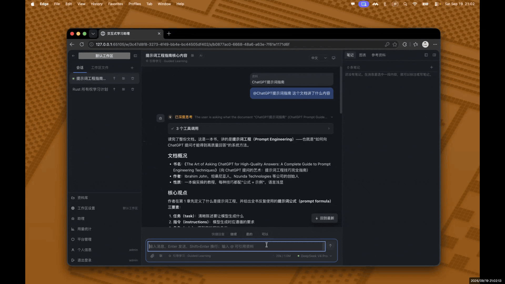
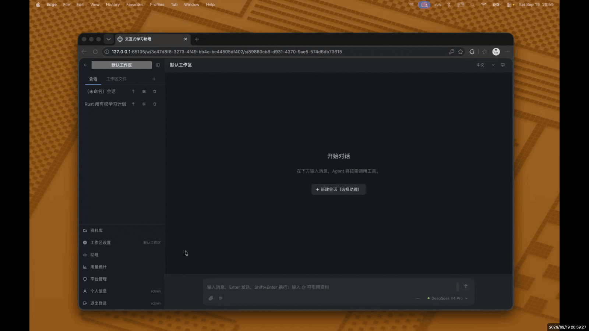
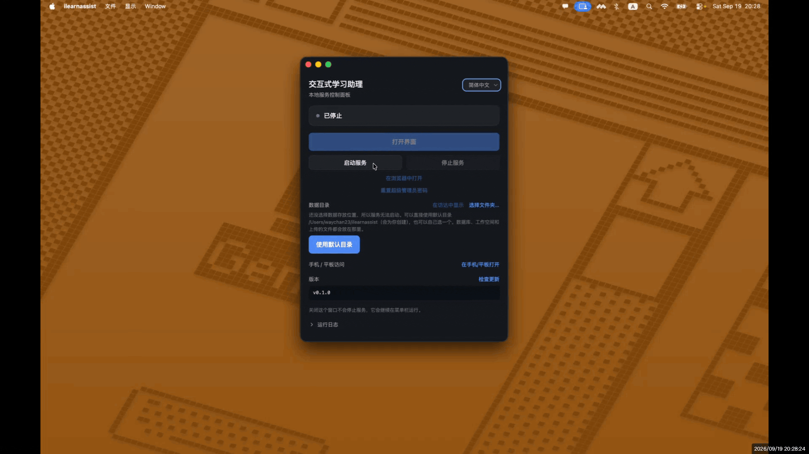
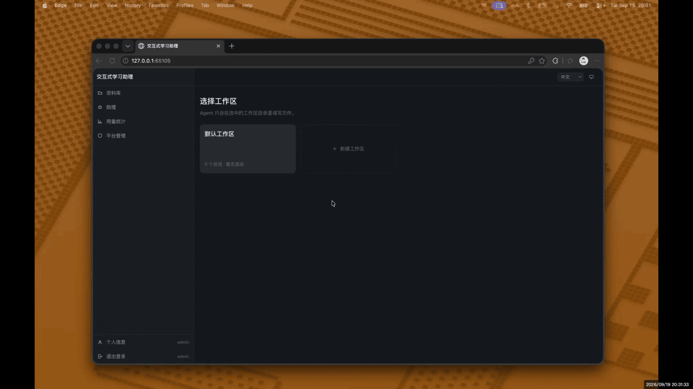
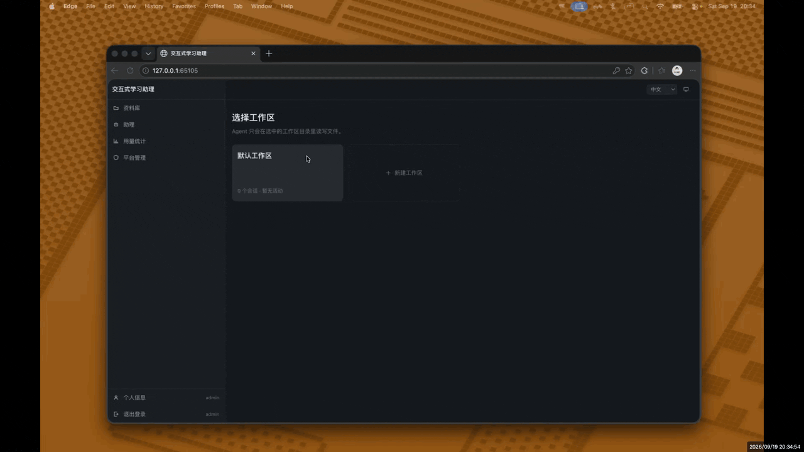

# Interactive Learning Assistant · ilearnassist

**English** | [简体中文](README.md)

[](https://github.com/waychan23/ilearnassist/actions/workflows/ci.yml)
[](LICENSE)

*The screenshots and demos below show the Chinese interface — the app is fully translated, and
English recordings are on the way.*

**Interactive Learning Assistant** (交互式学习助理) is an AI study companion that runs on your
own computer. It is not just another chat box: it draws up a study plan, teaches it one item at
a time, checks whether you actually understood with multiple-choice questions, keeps track of
your questions and notes, and lays all of that out in panels you can see. Everything lives in a
folder you choose and is uploaded nowhere — except to the model provider you configure yourself.

It ships with a built-in **引导学习 · Guided Learning** assistant and a set of study widgets,
so after installing it and pasting one model API key you can start learning. It is aimed at
people who would rather not live in a terminal: download an installer → pick a folder for your
data on first launch → create an administrator → paste a key → start studying.

> **Your data stays yours.** Uninstalling the app does not delete it — it lives in the folder
> you picked on first launch, separate from the program. See [FAQ](#faq).

---

## Features

### Studying and conversation

- **A built-in Guided Learning assistant** — a tutor that teaches in the right order: it finds
  out what you want to learn, produces a numbered study plan, waits for your confirmation, then
  teaches item by item. After each topic it poses multiple-choice questions, marks your answers
  honestly (including telling you plainly when you are wrong), and finishes with a summary that
  lists what needs more work. See [The built-in assistant](#the-built-in-assistant).
- **Seven study widgets** in the right-hand panel:
  - **Plan** — a multi-level TODO list with tickable progress, so you always know where you are;
    jump to any chapter.
  - **Quiz** — answer questions straight from the card, get them graded by the assistant, and
    re-attempt ones you skipped or dismissed.
  - **Threads** — every exchange is filed into a topic thread automatically, so you can browse
    a subject again later.
  - **Notes** — highlight any passage and write a note, or annotate a diagram, a table or a
    reference. A note carries its quote and jumps back to the original text.
  - **Figures** — the diagrams and tables the assistant produced, ready to open.
  - **Insights** — one button asks the assistant to review the whole conversation and report
    what it observed about your learning (difficulties, confusions, strengths).
  - **Resources** — the files and pages this conversation is working from, at a glance.
- **Ask about anything** — highlight a passage, or click a diagram, table, note or reference, and
  ask about it. The assistant reads the object as it is *now*, not as it was when written down.
- **Custom assistants** — bundle a persona prompt, a tool allow-list and default widgets into a
  reusable assistant, private to you or published to every account. A conversation copies it at
  creation, so editing the assistant later leaves existing conversations alone.



*A wrong answer is marked honestly; a note jumps back to its passage.*



*The figures and threads panels collect what the conversation drew and discussed.*

### Material

- **Library** — upload PDF / Word / Excel / PowerPoint / plain text, or keep a web page, all in
  one place.
- **`@` mentions** — type `@` in the composer to attach material to a turn. You can also `@` a
  whole workspace, letting the assistant read the files and conversations in it.
- **Document parsing** — PDFs and Office documents are extracted locally, with no network. Cloud
  parsers (MinerU, LlamaParse, …) can be configured for scanned documents.
- **File management** — browse a workspace as a tree; create, upload, rename, move (drag or
  dialog) and delete (to a recycle folder that keeps the bytes).
- **Web search and fetch** — Bing / DuckDuckGo with no key required, plus Tavily / SearXNG. The
  assistant can keep a page it found useful as a reference.
- **File preview** — highlighted code, Markdown, Mermaid diagrams, tables, images and PDFs, all
  in the app.



*Uploaded material is referenced with @, and the assistant reads it.*

### Accounts and deployment

- **Multiple accounts** — username and password sign-in; each account owns its workspaces,
  conversations, assistants and uploads, invisible to the others. Three tiers: superadmin,
  admin, user.
- **Desktop control panel** — start and stop the server from a window, choose where your data
  lives, and open the app on your phone with a QR code. macOS (Apple silicon and Intel),
  Windows and Linux.
- **Usage statistics** — every model call is recorded in a token ledger, browsable by day, model
  and purpose, so you can watch what it costs.
- **Chinese and English, light and dark themes.**

---

## Getting started

### Option 1: download an installer (recommended)

Pick the file for your system from [Releases](https://github.com/waychan23/ilearnassist/releases/latest):

| System | File |
| --- | --- |
| macOS (Apple silicon) | `ilearnassist-…-mac-arm64.dmg` |
| macOS (Intel) | `ilearnassist-…-mac-x64.dmg` |
| Windows | `ilearnassist-…-win-x64.exe` |
| Linux | `ilearnassist-…-linux-x64.AppImage` or `.deb` |

The builds are **not code-signed** (no certificate is bought), so your system will warn you about
an unidentified developer:

- **macOS**: right-click the app → **Open** → **Open** again. Once per machine.
- **Windows**: in the SmartScreen dialog, click **More info** → **Run anyway**.

Then walk through this once:

1. **Launch the app.** The control panel appears.
2. **Choose a data folder.** It suggests `~/ilearnassist` (in your home directory) — one click
   takes it, or pick somewhere else. This is where your database, workspaces and uploads will
   live, and the panel remembers it.
3. **Create the superadmin**: a username and a password. This is the highest-privileged account
   on this machine, so keep it somewhere safe. If you lose it, the control panel can reset it —
   see [FAQ](#faq).
4. The server starts by itself. Click **Open app**, sign in with the account you just made.
5. **Paste a model API key**: open **Platform console → Model services** from the menu, pick a provider
   you have an account with, paste its API key and save. **Until you do this the model list is
   empty** — the assistant needs a model to work at all.
6. **Start learning**: go back to the home page, create a workspace, open a conversation, choose
   the **引导学习 · Guided Learning** assistant, and tell it what you want to learn.



*From download to a usable window: four steps.*

> If your firewall asks, allow the app to communicate on this machine (127.0.0.1). Nothing is
> exposed to the network by default — that only changes if you turn on LAN sharing yourself.

### Option 2: run from source

Node.js ≥ 20 and pnpm ≥ 9 are required.

```bash
git clone https://github.com/waychan23/ilearnassist.git
cd ilearnassist
pnpm install

# Configure: where data lives, and at least one model key
cp .env.example .env
# edit .env and set DEEPSEEK_API_KEY (or another provider's key)

# A fresh data folder has no administrator — create one first
pnpm --filter @ilearnassist/server cli create-admin --username <you> --generate

pnpm dev
```

Open <http://localhost:5173> and sign in. The backend listens on `127.0.0.1:3720`.

> `ILA_DATA_DIR` is **required**, and `.env.example` already sets it to `./data` (relative to the
> project root). There is deliberately no default in the code: that directory decides where your
> data lives and whether it survives uninstalling the app.

---

## Built-in model providers

On first launch the providers below are written into the database; after that
**Platform console → Model services** is the source of truth. Chinese and international endpoints are
separate entries — the address and the key are not interchangeable between regions — so pick
whichever suits your network and paste one key.

| Provider | Endpoint |
| --- | --- |
| DeepSeek | `api.deepseek.com/v1` |
| Zhipu GLM | `open.bigmodel.cn/api/paas/v4` (intl: `api.z.ai/api/paas/v4`) |
| Qwen | `dashscope.aliyuncs.com/compatible-mode/v1` (intl: `dashscope-intl.aliyuncs.com/compatible-mode/v1`) |
| Kimi | `api.moonshot.cn/v1` (intl: `api.moonshot.ai/v1`) |
| MiniMax | `api.minimaxi.com/v1` (intl: `api.minimax.io/v1`) |
| OpenAI | `api.openai.com/v1` |
| Google Gemini | `generativelanguage.googleapis.com/v1beta/openai/` |

**Only configured providers are shown.** A provider without a key does not appear in a
conversation's model picker — better to offer nothing than to offer something that answers
nothing. Any OpenAI-compatible endpoint (Ollama, LM Studio, vLLM, your own gateway…) can be added
by hand in the console.



*The model appears in the picker once a key is saved.*

## The built-in assistant

**引导学习 · Guided Learning** is a public assistant, visible to and usable by every account. It
has all seven widgets above enabled, and it works like this:

1. You name a topic, or it helps you settle on one;
2. It searches the web to check the current state of the subject, then produces a study plan:
   background → one worked example up front (to give you a sense of the whole) → the core
   material as a list, taught one item per turn;
3. After each topic it poses multiple-choice questions. It waits for your answer, then marks it
   and explains — **it does not give the answer away when it asks**;
4. It asks whether to continue rather than marching on; say yes and it moves to the next item;
5. You can interrupt with a question at any point, or skip an item by number, and it returns to
   the main line;
6. At the end it summarises, listing both the material covered and what you should revisit.

It teaches at a depth-first, practical, best-practice level rather than as an introduction.

When a technical term is one the Chinese translation makes harder to follow, it gives the English
original in brackets the first time.

It belongs to the administrator account that created it, but it is **visible to and usable by
every account**. To teach your own way, open **Assistants** and **copy** it before editing:
changing the built-in itself (administrator only) affects every conversation started from then
on, while conversations already under way are untouched — a conversation copies the assistant's
definition when it is created, and the two go their separate ways after that.



*The plan panel grows item by item, and each item is checked with a question.*

---

## FAQ

**Where is my data?**
In the data folder you chose on first launch (it suggests `~/ilearnassist`). The control panel
shows that path and has a button to reveal it in your file manager. It contains
`db/sqlite/ilearnassist.sqlite` (the database), `users/<name>/workspaces/` (workspaces and their
files) and `users/<name>/sources/` (your uploads).

**How do I back it up?**
Copy that folder. That is the whole backup; the application itself can be reinstalled freely.

Inside it, `<data folder>/backups/` holds the snapshots taken **automatically before a database
upgrade** (the most recent five). When the schema has to change, the app copies the database first,
because an upgrade that succeeds and turns out to be wrong has no other way back.

**I forgot my password.**
Use **Reset administrator password** in the desktop control panel. It works **with the server
stopped** — a forgotten password is usually discovered at the same moment as something else
being wrong, so recovery cannot depend on a service that may be the thing that is broken. From a
source checkout, use
`pnpm --filter @ilearnassist/server cli reset-admin --username <you> --password-stdin`. For
safety, a superadmin's own password can *only* be reset this way, never from the web console.

**Why is the model list empty?**
No API key is configured. Set one in **Platform console → Model services** and it appears in the model
picker immediately.

**Can I use it from my phone?**
Yes. The control panel has a **LAN sharing** switch; turning it on shows a QR code that a phone
on the same Wi-Fi can scan. **Think before turning it on**: it makes your workspaces,
conversations and provider-key configuration reachable by anything on the network. It is off by
default.

**Does uninstalling delete my data?**
No. The program and your data are in different places, and uninstalling the app leaves the data
folder untouched. Delete that folder by hand to remove everything.

**How do I upgrade?**
**The database upgrades itself — there is nothing to do.** A newer build walks the schema forward
the first time it starts, and takes a snapshot into `<data folder>/backups/` (above) before it
touches anything. The panel says so: *"the database was upgraded from vX to vY"*, with the path of
the copy.

**The app itself is a download you install over the old one.** The panel tells you when a newer
release exists and takes you to the download page; installing over the top leaves your data alone,
because your data is not in the app. There is deliberately no one-click self-update: on macOS that
requires a paid code-signing certificate, which this project does not have (hence the install
warning above). Doing it this way on all three platforms is more honest than a button that works on
two of them.

**Which systems are supported?**
macOS (Apple silicon and Intel), Windows and Linux all have installers, and the source runs
anywhere with Node.js 20+.

---

## Project structure

```
apps/server/      Fastify backend — paths, SQLite, the agent loop, tools, routes
apps/web/         Vue 3 frontend — Pinia store, chat UI, SSE client
apps/desktop/     Electron control panel — starts/stops the server, packaged as an app
packages/shared/  types shared across the API boundary (no dependencies)
e2e/              Playwright end-to-end specs
config/           config.yaml (plus an optional config.local.yaml override)
docs/             architecture and subsystem reference
```

Browser/server architecture: the backend is Node/TypeScript (Fastify + SQLite + LangChain.js) and
the frontend is Vue 3. The desktop app is only a control panel — it starts the same backend and
reimplements none of it.

## Development and tests

The whole suite runs **offline** — no API keys, no network. The agent is driven against a local
fake OpenAI-compatible server, and the browser end-to-end run starts the real backend on a
throwaway database.

```bash
pnpm dev           # server (:3720) and web (:5173) together
pnpm typecheck     # tsc + vue-tsc + the e2e specs
pnpm test          # unit + integration
pnpm test:coverage # the same, with a coverage report
pnpm test:e2e      # browser end-to-end (run pnpm exec playwright install chromium first)
pnpm build         # production build of the web app
pnpm desktop:dev   # bundle and launch the desktop control panel
```

`pnpm typecheck` and `pnpm test` are expected to be clean before you commit, and new behaviour is
expected to arrive with tests. [CLAUDE.md](CLAUDE.md) records the conventions this repository
follows, including how to test agent behaviour without calling a real model.

## Credits

Every third-party dependency and its licence is listed in [CREDITS.md](CREDITS.md). Thank you to
everyone who maintains them.

One thing worth calling out: the packages that would add CAD preview support are **GPL-3.0** and
are optional peers which this project **deliberately does not install** — that is exactly why the
whole application can be released under MIT.

## License

[MIT](LICENSE) © ilearnassist contributors

## Documentation

- [Migrations](docs/migrations.md) — the three ways a schema change lands, immutable steps, and the snapshot taken before an upgrade
- [Architecture](docs/architecture.md) — system overview, agent loop, sandboxing, data model, SSE protocol
- [Configuration](docs/configuration.md) — full `config.yaml` reference, providers and search setup
- [Desktop app](docs/desktop.md) — the control panel, packaging, signing and cross-platform notes
- [Widgets](docs/widgets.md) — the side panel's contract, lifecycle and how to add one
- [Prompts](docs/prompts.md) — the system-prompt catalog and how to override an entry
- [Usage](docs/usage.md) — the token ledger and the statistics pages
- [Session locks](docs/session-locks.md) — the rules when several clients open one conversation
